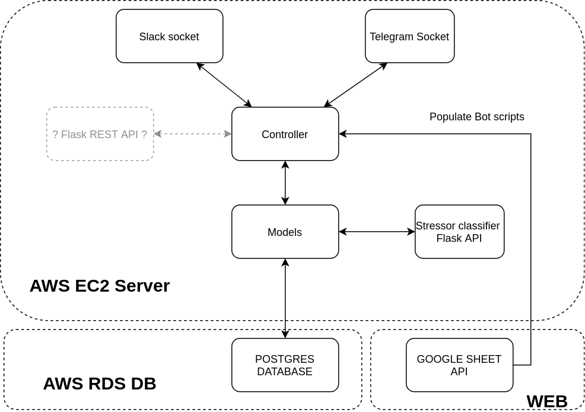
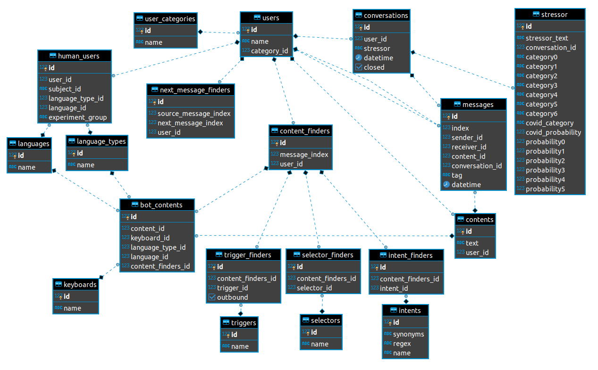
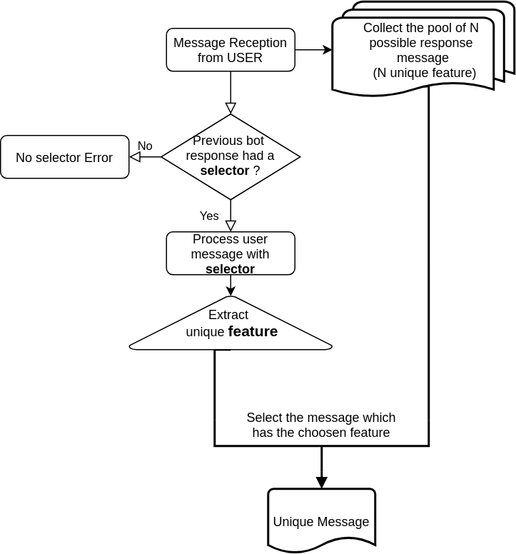
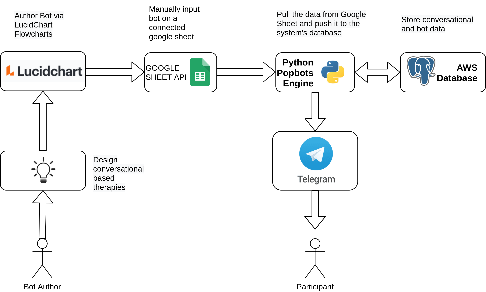
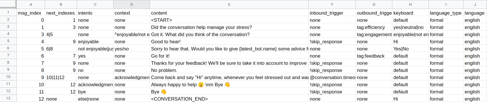

# UNIVERSAL Chatbot Backend 

## Description: 

This is a chatbot backend designed to work with telegram pooling as well as slack pooling. It is based on the https://github.com/python-telegram-bot/python-telegram-bot. This code support multithreading, each user gets it's own thread. The data is store in a Postgres Database. As a botscript Backend we've used an connected Google sheet which has it's own inputing rules, alternatively it could also use a simple Excel. This backend limitation made the code a little weird from time to time: we use strings to trigger function (see triggers), we use <TAG> to perform some actions. 
Ideally this project can be pushed further by creating a FlaskAPI connected to the main controller, right now the main controller `controllers.main.dialog_flow_engine` is already independent from the `telegram_socket` pooling code. This `dialog_flow_engine` might be considered as the a /respond route, but right now there is no routes/call needed other than this one needed. The telegram app already manage storing the messages on the users-end    

# 1. To deploy:

## 1.1 Deploying given the database has been configured
- Create a python3.7 venv (see online tutorials) recommended name popbots_venv
- Activate the venv by doing: 
    > source "venv_name"/bin/activate
- install all the required packages by navigating into the popbots folder and running 
    > pip3 install -r requirements.txt

- Several environment variables are mandatory in order for the code to communicate with slack, telegram and the Postgres database (Contact the Administrator to obtain a file with all the neccessary env variables). Once you have the file:

    1. Copy all the environment variables in the ~/.bash_profile (they look like export VARNAME="something"), the bash_profile might not exist, just create it. 
        > sudo nano ~/.bash_profile 
    
    2. Source the newly created env variables 
        > source ~/.bash_profile 
 

    Here is the list of all the required environment variables
    ```bash

    export TELEGRAM_BOT_TOKEN="" #telegram_bot_token optained via telegram bot father https://www.siteguarding.com/en/how-to-get-telegram-bot-api-token 
    export SLACK_API_TOKEN="" # not mandatory for telegram but for slack yes ! you need to create an a new slack app https://api.slack.com/apps?new_app=1
    export POPBOTS_POSTGRES_HOST="localhost" # where the database is hosted, localhost, or on an amazon rds instance
    export POPBOTS_DB_NAME="" #  name of popbots database
    export POPBOTS_DB_USERNAME="" #name of the db OWNER or with read/write access
    export POPBOTS_POSTGRES_PASSWORD="" #password of the db owner
    export SLACK_API_DEBUG_TOKEN="" # not mandatory, this is for the slack_logging_socket.py code, it is a slack app to pickup the platform errors. 

    ```
## 1.2 Deploying the Postgres Database

- Install Postgres on your machine or on create a AWS RDS Postgres instance
- Create a Database user and password 
- Create a database with a corresponding name and password
- Edit the .ini file (in models/core/database.ini) and complete all fiels accordingly (if you are working on your local machine, host will be localhost) 
- Create the tables with the file models/core/create_tables.py
- I recommend using DBEAVER to view and monitor database (https://dbeaver.io/download/)

## 1.3 Populating the Popbots Database with the bots scripts
This can be achieve via

- Navigate to /opt/Popbots directory
    > cd /opt/Popbots/

- Activate the popbots virtual environment
    > source ../popbots_venv/bin/activate

- Finally, run the populate_database_local.py script
    > python populate_database_local.py

This will pull the data from a folder "./bot_sample_data/script.xlsx" this is an excel file containing all the bot scripts. 
You will see terminal logs to indicate if the operation was successfull. 

NOTE : This excel can be hosted in the google drive sheet to improve collaboration. To do this:

1. Follow this medium tutorial to create a service account from which you can get credential. 
https://medium.com/@denisluiz/python-with-google-sheets-service-account-step-by-step-8f74c26ed28e 

Optain the service_credentials.json file an put it a directory at root called credentials/

2. Create a google spreadsheet in google sheet and get the spreadsheet_id from the URL and add it in the `populate_database_live.py` script at the `SPREADSHEET_ID = "your id"`

3. Copy all the scripts found in the script.xlsx with the proper tab names inside your google sheet. 


## 1.4 Running the code/telegram/slack sockets

If you are just testing you can just run the python or telegram script like so:
- Activate the venv by doing: 
    > source "venv_name"/bin/activate
- Run the code
    > python3 telegram_socket.py
    or
    > python3 slack_socket.py

In deployment we will use PM2 as a process manager, for logs and also restarting the APP in case it crashes

- For installation (see instructions here : https://blog.pm2.io/2018-09-19/Manage-Python-Processes/)

To launch the program via pm2
> pm2 start telegram_socket.py -interpreter ../popbots__venv/bin/python --name popbots_telegram_socket


# 2. Code documentation

## 2.1. Project structure 

This project works best with the stress classifier flask api https://github.com/PervasiveWellbeingTech/Popbots-Flask-API-Stressor-Classifier 


### 2.1.1. (REST API)

Popbots API is structured as follow (see image below). As much as possible it follow the REST API guidelines (here routers are controllers) 


### 2.1.2. Database Structure (as of Sept 2020)


### ER (Entity Relation) Diagram



The database design is centered on the user, users can be Humans or Bot. This design may allow in the future direct conversation with human if needed. 


To make authoring the bots scripts convienient, each bot has a 0-N index. This arbitraly given numbers are limiting the use of normal key-pair relationships since these requires unique ids. This explains why there is no relationships between next_message_finders and content_finders

### **Table related to users:**

users: host the user_id and name, category is the type of user in the table user_category (1: humans , 2: bots)

human_users: host informations about the human and experiment related variables experiment groups etc 

languages: language of the user

languages_types: designed because there was an formal and informal language type


### **Table related to managing and storing conversations:**

**conversations**: Table hosting conversation, the conversation granularity in our case is set at the "Stressor" level, one conversation must have one stressor. Conversations start with Hi and finish by giving a feedback about the conversation. 

**messages**: Messages are hosted in a conversation and have a sender and receiver id (messages objects are the same for bots or persons), they have a content (the text) , the "tag" variable is here to tag user's conversation say tag='stressor' means that at that particular message the user gave a stressor. We also store "answering time" which is an int which store the person or the bot took to answer. 

**contents**: simple table containing a text

**stressor**: the stressor object represents the conversation stressor and this host probabilities of the categories of that stressor.

### **Table related to bot content:** 

**next_message_finders**: This is just a one to many table, where the message index and next message index for each bot is contained. Since we wanted to have a simple index 0-N for each bot. The user_id (bot_id) is the main differentiator here, otherwise we would have say index 0 for multiple bots.  


**content_finders**: All the content (text) needs to be organize and indexed. This is what contents_finders is about. Each message in a bot contains multiple intent,context, triggers at the same message index
Each content_finders may have multiple bot_contents, this table was setup to support different language at any index. 

**bot_contents**: host the content (text ) of the bot, there might be different bot_contents because there might be different languages or language type (formal, informal)

**contents**: simple table hosting the content text

**Trigger**: Triggers are element which perform/trigger a certain action in the code 
Notables triggers are:
- !random > this perform a random selection between multiple bot message if there is.
- tag: > this tags a message ex: tag:stressor
- !skip_response > this skips users response at index n to retrieve the next bot message at n+1 > this allow back to back messages
- ~Farewell Module > this coupled with a <SWITCH> in text perform a switch between modules
- !stressor > calls a stressor function which calls the stressor classifier
- @ > ex: @conversation.timeout_threshold=180 set the conversation timeout to 180 seconds
- #user.name > declare that what the user said at that index is the name for example

This is a flexible param which must be refactored when leaving the proof-of-concept codebase

**Intent**
This is pretty standart concept, each message at an index n has an intent ( see the Intent pragraph below)  

**Context** 
Context was name selector before, it in the pool of defined intent as well as the method to process the user's message to get the next intent

### ******


## 2.2. Functionnality descriptions

### 2.2.1. Intent/Context process 

Intents and contexts  solves a major problem when trying to build a chatbot with user's freedom in the response and branching tree. 
Most system (DialogFlow, Rasabots etc) rely only "on one to many index tables" and intent for each of the next index. Our system also use those, but there is an additional layer of verification. contexts are given to prevent error while authoring.

A typical bot script may look like this :

```
Hi {user}, are you happy ? (bot expect yes or no)

if: user say yes --> Good, it is nice to feel happy.

else: user say no --> Sorry to hear that, I am here to help.
```
In this given scenario, the bot script table look like this:


|index|bot_message|intent|context|
|---|---|---|---|
|0|Hi {user.name}, are you happy ?|none|yes/no|
|1|Good, it is nice to be happy.|yes|none|
|2|Sorry to hear that, I am here to help|no|none|

To this table we need a one to many correspondance table

|index|next_index|
|---|---|
|1|2|
|1|3|

Here for message index (1) there is two next possible indexes (2,3).

Given the context of yes/no for message (1) we will parse the user message and look for a positive or negative intent in the answer and will extract one intent (Extracted Intent)

Base on the **Extracted intent** we will select the good response between (2,3)




### 2.2.2. Context

Context define at index n what are the expected intents at indexes n+1 as well as the selection process needed to extract the intent from the user's . It can also be the process to use to select the next content/context
Reminder: We introduce the concept of context to make sure that inputting as been correctly done. 

Typical contexts are as follow:

* context follow a rigorous pattern: condition1/condition2. For 3 branches it follows the pattern condition1/condition2/condition3.  For x conditions condition1/condition2/condition3/…/conditionX 

* By design there is no deadlock right now, meaning there is always , if none of the above intent are selected an alternative given by the intent 'alternative' . 

The developer can create special contexts in order to perform a custom intent selection process. 

These are contexts with the "@" tag in the beggining. 

Example:

Here is a function which return condition (yes) if the word count in the user message (input_string ) is greater than a particular word count : 

```python 
def min_word(input_string,word_len,condition,alternative):
    
    if len(word_tokenize(input_string))>word_len: #word_tokenize function is provided by nltk
        return condition,[condition,alternative]
    else:
        return alternative,[condition,alternative]
```
This function can be called via a intent selection function named @min_word(input_string,4,"yes","no"), this call for instance will return yes if the word count is greater than 4 or no reversely


**/!\ Caution:** If no the intents extracted from the context does not match the intent you can find at the next indexes, it will pop-up an authoring error


## 2.3 Bot Authoring/inputting Process

Here is a diagram of what the overall Authoring Process looks like. 




/!\ This must be done with rigor! Not following the naming pattern, leaving an empty cell, etc will break the bot and might break the python code as well. 

Here is an Example of the google sheet of the Farewell module




# Filling content

## Rules: 

- A bot conversation should always start with <START> flag and Finish with <CONVERSATION_END>
- The <START> flag must always be in the text at index 0
- All the columns must be filled for each row ( no NA is accepted) 
- No content must be added outside of the given columns ( such as comments). - - Comments are ok but using the google sheet "Comments"


## Filling Context/Intents

* All intent must be filled in the intents columns, within a single message they are separated with | say yes|none >> this happens when two branch leads to a single message

* Context are also separated with |, but the intents within the each context are separated with / . Example: yes/no|none but this is almost never used. Usually there is one context : yes/no


## Back to back messages vs Line Breaks:

If you want the message to be split in multiple messages on Telegram or Slack. You can create multiple indexes(message 1, 2, 3). If you have simple back to back messages can include "\nm"  in the message where the line break needs to happen in the text. 
you just 
If you want to return to the line though, you need to add \n

## Dynamic Variables:

Dynamic variables can be added to the text wrapped in curly brackets {} (ex: Hi {user.name}). 

**/!\ Caution:** The name of the variable needs to map exactly what is declared in the python code. A list of possibilities will be provided. New variables need to be discussed with 
the development team. 

|user.name|
|---|
|bot_user.name|
|conversation.stressor|
|stressor.probability0|


## Images:

Images can be also added directly in that file. By including in the bot text the name of the image file wrapped with the wrapper $img$ (ex: $img$IMAGE_NAME$img$ )

**/!\ Caution:** images format needs to be png (ex: IMAGE_NAME.png). Furthermore, this image needs to be uploaded to the server. There is no automatic way to do this for the moment, you must inform the platform administrator. 

## Filling Keyboard 

The default keyboard is "default". A different keyboard is inputted as follows: Button1| Button2| Button3 (example: Help| No Help|Neutral)

/!\ Caution: Buttons entities are separated with a comma (e.g. Help|No Help| Neutral or Likely, Unlikely) if you have a >>> ' <<<  as in I'm you must include a >>> \ <<< as in I\'m 


## Pushing the bots to the database, pulling from 


### 1. Locally: 

Run the populate_database_local.py script
    > python populate_database_local.py
Errors will be printed here, and if there is try to identify them and correct them

### 2. On an Ec2 remote server, provided the code is stored in /opt/Popbots


A python script needs to be run on the server in order to populate the popbots database.  

To do this: 

--ONLY ONCE Steps-- 
1. Contact the "system administrator" to obtain the [AWS_CREDENTIALS] file. 
2. Open a terminal and navigate to the folder where [AWS_CREDENTIALS] is.
3. Grant permission to the [AWS_CREDENTIALS]
> chmod 400 [AWS_CREDENTIALS].pem

--ONLY ONCE Steps--

5. Ssh into the remote server

> ssh -i "[AWS_CREDENTIALS].pem" [USER_NAME]@[EC2_ADDRESS]

6. Navigate to /opt/Popbots directory

> cd /opt/Popbots/
7. Activate the popbots virtual environment
> source ../popbots_venv/bin/activate

8. Finally, run the populate_database_live.py script

> python populate_database_live.py

You will see terminal logs to indicate if the operation was successfull. 


